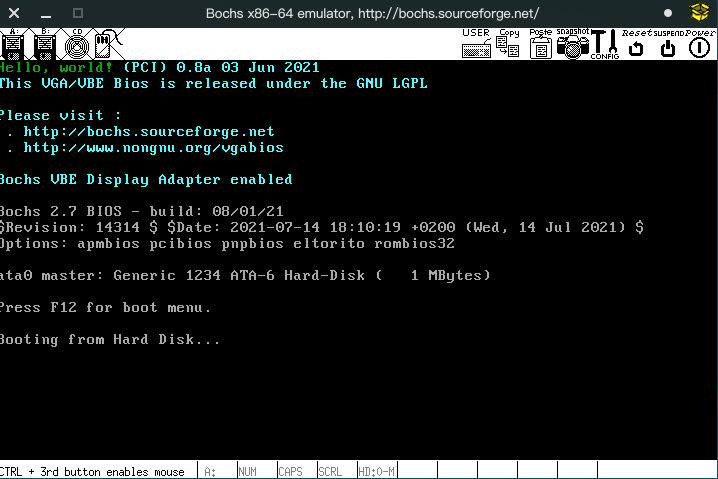

# 汇编语言与汇编软件

## 配置运行环境 一个简单的Hello World
``` sh
sudo pacman -S bochs

```

配置bochs，编写`bochsrc`

``` sh
###########
# bochsrc #
###########

# 使用的内存，单位MB
megs: 32

# 读取的bios rom
romimage: file=/usr/share/bochs/BIOS-bochs-latest
vgaromimage: file=/usr/share/bochs/VGABIOS-lgpl-latest

# 使用的软盘镜像
# floppya: 1_44=hd60M.img, status=inserted

# 使用的磁盘镜像
ata0-master: type=disk, path="b.img"

# 引导类型
boot: disk

# 日志输出路径
log: bochs.out

# 外设
mouse: enabled=0
# 注意这里与书中不同，书中的配置方式已过时，无法正常启动
keyboard: keymap=/usr/share/bochs/keymaps/x11-pc-us.map

ata0: enabled=1, ioaddr1=0x1f0, ioaddr2=0x3f0, irq=14
```

编写 `main.asm` 汇编程序

``` assembly
    org 0x07c00
    mov ax,cs
    mov ds,ax
    mov es,ax
    mov ax,Message
    mov bp,ax
    mov cx, 13
    mov ax,0x1301
    mov bx,0x0002
    mov dh,0
    mov dl,0
    int 0x10
    jmp $
Message:
    db "Hello, world!"
    times 510-($-$$) db 0
    dw  0xaa55

```

编写一份makefile 就不用记那么长的命令了
``` makefile
.PHONY: build

obj=main

build:
        nasm $(obj).asm -o $(obj).o
        dd if=/dev/zero of=b.img bs=512 count=2048
        dd if=$(obj).o of=b.img bs=512 seek=0 conv=notrunc

.PHONY: clean

clean:
        $(RM) ./*.img ./*.o
```

``` sh
# 编译
make build

# 清理
make clean
```

``` sh
bochs -f ./bochsrc

# 然后键入 6

# 然后键入 c
```



``` sh
# 退出的话 在终端ctrl+c 然后键入 q

```

``` sh
bochs -f ./bochsrc
========================================================================
                        Bochs x86 Emulator 2.7
              Built from SVN snapshot on August  1, 2021
                Timestamp: Sun Aug  1 10:07:00 CEST 2021
========================================================================
00000000000i[      ] BXSHARE not set. using compile time default '/usr/share/bochs'
00000000000i[      ] reading configuration from ./bochsrc
00000000000e[      ] ./bochsrc:16: ataX-master/slave CHS set to 0/0/0 - autodetection enabled
------------------------------
Bochs Configuration: Main Menu
------------------------------

This is the Bochs Configuration Interface, where you can describe the
machine that you want to simulate.  Bochs has already searched for a
configuration file (typically called bochsrc.txt) and loaded it if it
could be found.  When you are satisfied with the configuration, go
ahead and start the simulation.

You can also start bochs with the -q option to skip these menus.

1. Restore factory default configuration
2. Read options from...
3. Edit options
4. Save options to...
5. Restore the Bochs state from...
6. Begin simulation
7. Quit now

Please choose one: [6]
00000000000i[      ] installing x module as the Bochs GUI
00000000000i[      ] using log file bochs.out
Next at t=0
(0) [0x0000fffffff0] f000:fff0 (unk. ctxt): jmpf 0xf000:e05b          ; ea5be000f0
<bochs:1> c
^CNext at t=2812719497
(0) [0x000000007c1a] 0000:7c1a (unk. ctxt): jmp .-2  (0x00007c1a)     ; ebfe
<bochs:2> q
(0).[2812719497] [0x000000007c1a] 0000:7c1a (unk. ctxt): jmp .-2  (0x00007c1a)     ; ebfe

```
