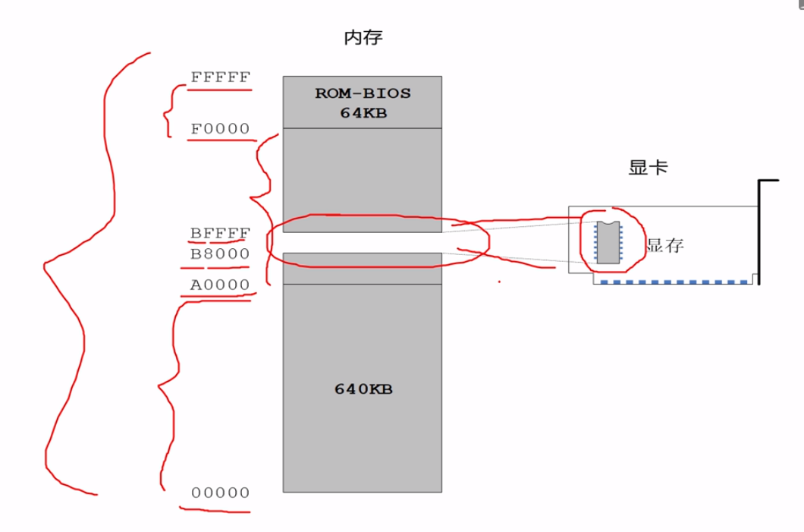
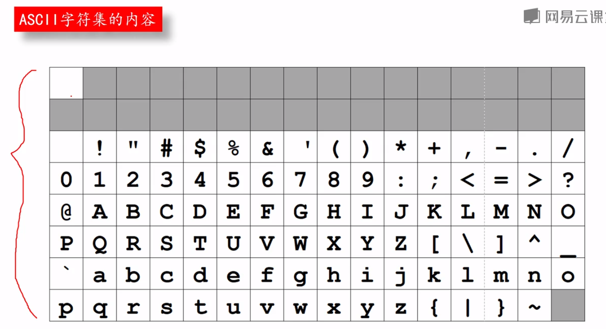
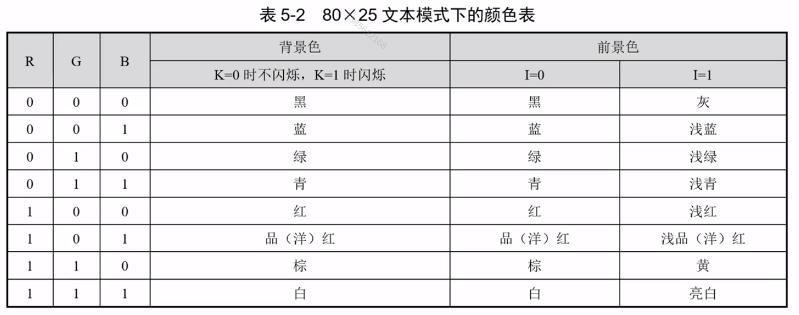
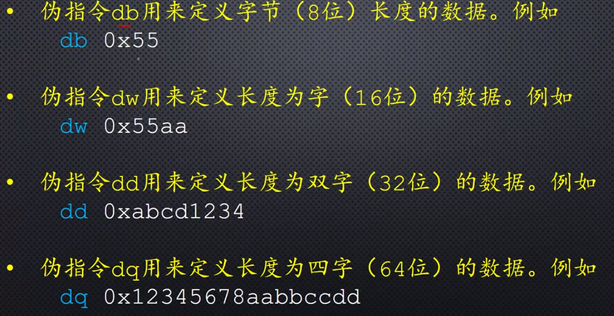
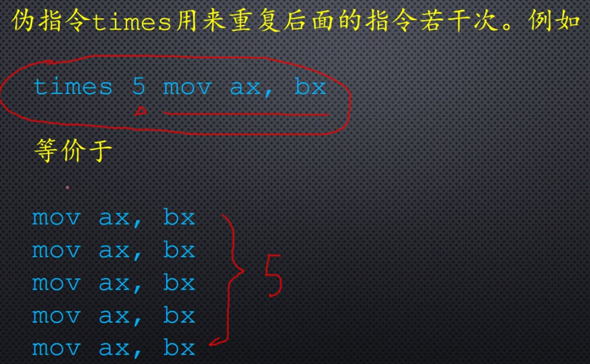

# 在屏幕上显示

## 显卡与显存
显卡的存储器简称显存，用显存中的数据来控制像素
对于字符有专门的字符显示器，对于图片则是操作像素



### 基础知识

#### mov指令
- `mov a, b` => `mov a <- b`
- `mov 段寄存器, 通用寄存器`
  - `mov ds, ax`
  - `mov ds, bx`
  - `mov ds, cx`
- `mov 段寄存器, 内存地址`
  - `mov es, [0x6C]`


``` assembly
mov [0x01], [0x02] X

mov ax, [0x02]
mov [0x01], ax
```

``` assembly
mov ip, 0xf000 X

mov ds, ax
mov es, [0x3002]
```


## 显示文本
`0xb800`是文本模式显示缓冲区的地址
#### 字符编码




``` assembly
    mov ax, 0xb800
    mov ds, ax

    mov byte [0x00], 'A'
    mov byte [0x01], 0x04       ;黑底红字无闪烁

    mov byte [0x02], 's'
    mov byte [0x03], 0x04

    mov byte [0x04], 's'
    mov byte [0x05], 0x04

    mov byte [0x06], 'e'
    mov byte [0x07], 0x04

    mov byte [0x08], 'm'
    mov byte [0x09], 0x04

    mov byte [0x0a], 'b'
    mov byte [0x0b], 0x04

    mov byte [0x0c], 'l'
    mov byte [0x0d], 0x04

    mov byte [0x0e], 'y'
    mov byte [0x0f], 0x04

    mov byte [0x10], '.'
    mov byte [0x11], 0x04

```

``` sh
nasm main.asm -l main.lst
```

``` assembly
     1                                  ;   org 0x07c00
     2                                  ;   mov ax,cs
     3                                  ;   mov ds,ax
     4                                  ;   mov es,ax
     5                                  ;   mov ax,Message
     6                                  ;   mov bp,ax
     7                                  ;   mov cx, 13
     8                                  ;   mov ax,0x1301
     9                                  ;   mov bx,0x0002
    10                                  ;   mov dh,0
    11                                  ;   mov dl,0
    12                                  ;   int 0x10
    13                                  ;   jmp $
    14                                  ;Message:
    15                                  ;   db "Hello, world!"
    16                                  ;   times 510-($-$$) db 0
    17                                  ;   dw  0xaa55
    18                                  
    19 00000000 B80008                      mov ax, 0xb800
    20 00000003 8ED8                        mov ds, ax
    21                                  
    22 00000005 C606000041                  mov byte [0x00], 'A'
    23 0000000A C606010004                  mov byte [0x01], 0x04       ;黑底红字无闪烁
    24                                  
    25 0000000F C606020073                  mov byte [0x02], 's'
    26 00000014 C606030004                  mov byte [0x03], 0x04
    27                                  
    28 00000019 C606040073                  mov byte [0x04], 's'
    29 0000001E C606050004                  mov byte [0x05], 0x04
    30                                  
    31 00000023 C606060065                  mov byte [0x06], 'e'
    32 00000028 C606070004                  mov byte [0x07], 0x04
    33                                  
    34 0000002D C60608006D                  mov byte [0x08], 'm'
    35 00000032 C606090004                  mov byte [0x09], 0x04
    36                                  
    37 00000037 C6060A0062                  mov byte [0x0a], 'b'
    38 0000003C C6060B0004                  mov byte [0x0b], 0x04
    39                                  
    40 00000041 C6060C006C                  mov byte [0x0c], 'l'
    41 00000046 C6060D0004                  mov byte [0x0d], 0x04
    42                                  
    43 0000004B C6060E0079                  mov byte [0x0e], 'y'
    44 00000050 C6060F0004                  mov byte [0x0f], 0x04
    45                                  
    46 00000055 C60610002E                  mov byte [0x10], '.'
    47 0000005A C606110004                  mov byte [0x11], 0x04

```

### 完善主引导程序

``` assembly
start:
    mov ax, 0x800
    mov ds, ax

    mov byte [0x00], 'A'
    mov byte [0x01], 0x04       ;黑底红字无闪烁

    mov byte [0x02], 's'
    mov byte [0x03], 0x04

    mov byte [0x04], 's'
    mov byte [0x05], 0x04

    mov byte [0x06], 'e'
    mov byte [0x07], 0x04

    mov byte [0x08], 'm'
    mov byte [0x09], 0x04

    mov byte [0x0a], 'b'
    mov byte [0x0b], 0x04

    mov byte [0x0c], 'l'
    mov byte [0x0d], 0x04

    mov byte [0x0e], 'y'
    mov byte [0x0f], 0x04

    mov byte [0x10], '.'
    mov byte [0x11], 0x04

current:
    times 510-(current-start) db 0
    db 0x55, 0xaa               ; DB作为汇编语言中的伪操作命令，它用来定义操作数占用的字节数

```

### 段间直接绝对远跳转指令
`jmp 0x0000:0x7c00`

``` assembly
start:
    mov ax, 0xb800
    mov ds, ax

    mov byte [0x00], 'A'
    mov byte [0x01], 0x0c       ;黑底红字无闪烁

    mov byte [0x02], 's'
    mov byte [0x03], 0x04

    mov byte [0x04], 's'
    mov byte [0x05], 0x04

    mov byte [0x06], 'e'
    mov byte [0x07], 0x04

    mov byte [0x08], 'm'
    mov byte [0x09], 0x04

    mov byte [0x0a], 'b'
    mov byte [0x0b], 0x04

    mov byte [0x0c], 'l'
    mov byte [0x0d], 0x04

    mov byte [0x0e], 'y'
    mov byte [0x0f], 0x04

    mov byte [0x10], '.'
    mov byte [0x11], 0x04

    jmp 0x0000:0x7c00
current:
    times 510-(current-start) db 0
    db 0x55, 0xaa               ; DB作为汇编语言中的伪操作命令，它用来定义操作数占用的字节数

```

``` sh
bochs -f ./bochsrc 
# 进入配置好的环境
6
# 在0x7c00处打断点
b 0x7c00
# 继续执行
c
# 反汇编20条指令
u/20
# 逐步观察
s/n
s/n
s/n
s/n
s/n
s/n
```

###  使用标号计算JMP指令跳转的偏移地址

``` sh
again:
    jmp 0x0000:0x7c00+again

```

### 段内间接绝对近跳转指令

不改变`cs`的内容，只改变`ip`的内容

``` assembly
    mov bx, 0x7c00
again:
    jmp bx
```

### 相对偏移量的短跳转和近跳转
- [128~-127] 短跳转

``` assembly
jmp (short) start
```

- [2^15~-2^15+1] 近跳转

``` assembly
jmp (near) start
```

## 显示数字

``` assembly
数字1 -> 0000 0001 (0x01)
字符1 -> 0011 0001 (0x31)
```

**数字+0x30 == 对应字符**

### 除法指令 div
- 如果在指令中指定的是8位寄存器或者8位操作数的内存地址,则意味这被除数在AX(16位)中
- 相除后，商寄存器AL中，余数在寄存器AH中

``` assembly
div bh
div byte [0x2002]
```

- 如果在指令中指定的是16位寄存器或者16位操作数的内存地址,则意味这被除数是32位的，低16位放在AX(16位)中,高16位放在DX(16位)中
- 相除后，商寄存器AX中，余数在寄存器DX中

``` assembly
dic bx
dic word [0x2002]
```

- 如果在指令中指定的是32位寄存器或者32位操作数的内存地址,则意味这被除数是64位的，低32位放在EAX(32位)中,高32位放在EDX(32位)中
- 相除后，商寄存器EAX中，余数在寄存器EDX中

``` assembly
div ebx
div dword [0x2002]
```


- 如果在指令中指定的是64位寄存器或者64位操作数的内存地址,则意味这被除数是128位的，低64位放在RAX(64位)中,高64位放在RDX(64位)中
- 相除后，商寄存器RAX中，余数在寄存器RDX中

``` assembly
div Rbx
div qword [0x2002]
```


> 试用

``` assembly
start:
  ; 计算378除以37的结果
  mov ax, 378
  mov bl, 37
  div bl                        ;AL: 商 AH: 余数

  mov ax, 0xb800
  mov ds, ax
current:
  times 510-(current-start) db 0
  db 0x55, 0xaa

```

### XOR

> 65535 / 10

``` assembly
start:
  ; 计算65535除以10的结果
  mov dx, 0x0
  mov ax, 0xffff
  mov bx, 10
  div bx                        ;AL: 商 AH: 余数

  mov ax, 0xb800
  mov ds, ax
current:
  times 510-(current-start) db 0
  db 0x55, 0xaa

```

``` sh
Please choose one: [6]
00000000000i[      ] installing x module as the Bochs GUI
00000000000i[      ] using log file bochs.out
Next at t=0
(0) [0x0000fffffff0] f000:fff0 (unk. ctxt): jmpf 0xf000:e05b          ; ea5be000f0
<bochs:1> b 0x7c00
<bochs:2> c
(0) Breakpoint 1, 0x0000000000007c00 in ?? ()
Next at t=17178869
(0) [0x000000007c00] 0000:7c00 (unk. ctxt): mov dx, 0x0000            ; ba0000
<bochs:3> s
Next at t=17178870
(0) [0x000000007c03] 0000:7c03 (unk. ctxt): mov ax, 0xffff            ; b8ffff
<bochs:4> r
CPU0:
rax: 00000000_0000aa55
rbx: 00000000_00000000
rcx: 00000000_00090000
rdx: 00000000_00000000
eflags 0x00000082: id vip vif ac vm rf nt IOPL=0 of df if tf SF zf af pf cf
<bochs:5> s
Next at t=17178871
(0) [0x000000007c06] 0000:7c06 (unk. ctxt): mov bx, 0x000a            ; bb0a00
<bochs:6> r
CPU0:
rax: 00000000_0000ffff
rbx: 00000000_00000000
rcx: 00000000_00090000
rdx: 00000000_00000000
eflags 0x00000082: id vip vif ac vm rf nt IOPL=0 of df if tf SF zf af pf cf
<bochs:7> s
Next at t=17178872
(0) [0x000000007c09] 0000:7c09 (unk. ctxt): div ax, bx                ; f7f3
<bochs:8> r
CPU0:
rax: 00000000_0000ffff
rbx: 00000000_0000000a
rcx: 00000000_00090000
rdx: 00000000_00000000
eflags 0x00000082: id vip vif ac vm rf nt IOPL=0 of df if tf SF zf af pf cf
<bochs:9> s
Next at t=17178873
(0) [0x000000007c0b] 0000:7c0b (unk. ctxt): mov ax, 0xb800            ; b800b8
<bochs:10> r
CPU0:
rax: 00000000_00001999
rbx: 00000000_0000000a
rcx: 00000000_00090000
rdx: 00000000_00000005
eflags 0x00000082: id vip vif ac vm rf nt IOPL=0 of df if tf SF zf af pf cf
```

> 同样的作用

`XOR` == `亦或`
- 1 xor 1 => 0
- 1 xor 0 => 1
- 0 xor 1 => 1
- 0 xor 0 => 0

`xor r/m, r/m/imm` 结果放在前面

``` assembly
xor dx, dx
```

### add指令

`add` 加法指令

``` assembly
add dl, 0x30
```

### 临时存放计算结果
可以使用`db`指令 效果类似数组
``` assembly
start:
  mov cx, 0
  mov ds, cx

  ; 计算65535除以10的结果
  mov ax, 0xffff
  xor dx, dx                    ; 初始化被除数

  mov bx, 10                    ; 初始化除数

  div bx                        ; AX: 商 DX: 余数
  add dl, 0x30                  ; 将数字转换为数字字符
  mov [0x7c00+buffer+0], dl

  xor dx, dx
  div bx                        ; AX: 商 DX: 余数
  add dl, 0x30                  ; 将数字转换为数字字符
  mov [0x7c00+buffer+1], dl

  xor dx, dx
  div bx                        ; AX: 商 DX: 余数
  add dl, 0x30                  ; 将数字转换为数字字符
  mov [0x7c00+buffer+2], dl

  xor dx, dx
  div bx                        ; AX: 商 DX: 余数
  add dl, 0x30                  ; 将数字转换为数字字符
  mov [0x7c00+buffer+3], dl

  xor dx, dx
  div bx                        ; AX: 商 DX: 余数
  add dl, 0x30                  ; 将数字转换为数字字符
  mov [0x7c00+buffer+4], dl

buffer:
  times 5 db 0              ; 临时数组

current:
  times 510-(current-start) db 0
  db 0x55, 0xaa

```


### es寄存器 与 段超越前缀的使用

`es`寄存器可以辅助程序员在两个段内操作程序，不需要来回设定、恢复`ds`

``` assembly
start:
  mov cx, 0
  mov ds, cx

  ; 计算65535除以10的结果
  mov ax, 0xffff
  xor dx, dx                    ; 初始化被除数

  mov bx, 10                    ; 初始化除数

  div bx                        ; AX: 商 DX: 余数
  add dl, 0x30                  ; 将数字转换为数字字符
  mov [0x7c00+buffer+0], dl

  xor dx, dx
  div bx                        ; AX: 商 DX: 余数
  add dl, 0x30                  ; 将数字转换为数字字符
  mov [0x7c00+buffer+1], dl

  xor dx, dx
  div bx                        ; AX: 商 DX: 余数
  add dl, 0x30                  ; 将数字转换为数字字符
  mov [0x7c00+buffer+2], dl

  xor dx, dx
  div bx                        ; AX: 商 DX: 余数
  add dl, 0x30                  ; 将数字转换为数字字符
  mov [0x7c00+buffer+3], dl

  xor dx, dx
  div bx                        ; AX: 商 DX: 余数
  add dl, 0x30                  ; 将数字转换为数字字符
  mov [0x7c00+buffer+4], dl


  ; 转化到文本模式的显存段
  mov cx, 0xb800
  mov es, cx                    ; es extra segment reg

  mov al, [0x7c00+buffer+4]
  mov [es:0x00], al             ; `es:` 段超越前缀
  mov byte [es:0x01], 0x2f

  mov al, [0x7c00+buffer+3]
  mov [es:0x02], al
  mov byte [es:0x03], 0x2f

  mov al, [0x7c00+buffer+2]
  mov [es:0x04], al
  mov byte [es:0x05], 0x2f

  mov al, [0x7c00+buffer+1]
  mov [es:0x06], al
  mov byte [es:0x07], 0x2f

  mov al, [0x7c00+buffer+0]
  mov [es:0x08], al
  mov byte [es:0x09], 0x2f

again:
  jmp again

buffer:
  times 5 db 0              ; 临时数组

current:
  times 510-(current-start) db 0
  db 0x55, 0xaa

```


## 显示标号的汇编地址

``` assembly
  mov ax,0xb800                 ;指向文本模式的显示缓冲区
  mov es,ax

  ;以下显示字符串"Label offset:"
  mov byte [es:0x00],'L'
  mov byte [es:0x01],0x07
  mov byte [es:0x02],'a'
  mov byte [es:0x03],0x07
  mov byte [es:0x04],'b'
  mov byte [es:0x05],0x07
  mov byte [es:0x06],'e'
  mov byte [es:0x07],0x07
  mov byte [es:0x08],'l'
  mov byte [es:0x09],0x07
  mov byte [es:0x0a],' '
  mov byte [es:0x0b],0x07
  mov byte [es:0x0c],'o'
  mov byte [es:0x0d],0x07
  mov byte [es:0x0e],'f'
  mov byte [es:0x0f],0x07
  mov byte [es:0x10],'f'
  mov byte [es:0x11],0x07
  mov byte [es:0x12],'s'
  mov byte [es:0x13],0x07
  mov byte [es:0x14],'e'
  mov byte [es:0x15],0x07
  mov byte [es:0x16],'t'
  mov byte [es:0x17],0x07
  mov byte [es:0x18],':'
  mov byte [es:0x19],0x07

  mov ax,number                 ;取得标号number的汇编地址
  mov bx,10

  ;设置数据段的基地址
  mov cx,cs
  mov ds,cx

  ;求个位上的数字
  mov dx,0
  div bx
  mov [0x7c00+number+0x00],dl   ;保存个位上的数字

  ;求十位上的数字
  xor dx,dx
  div bx
  mov [0x7c00+number+0x01],dl   ;保存十位上的数字

  ;求百位上的数字
  xor dx,dx
  div bx
  mov [0x7c00+number+0x02],dl   ;保存百位上的数字

  ;求千位上的数字
  xor dx,dx
  div bx
  mov [0x7c00+number+0x03],dl   ;保存千位上的数字

  ;求万位上的数字
  xor dx,dx
  div bx
  mov [0x7c00+number+0x04],dl   ;保存万位上的数字

  ;以下用十进制显示标号的偏移地址
  mov al,[0x7c00+number+0x04]
  add al,0x30
  mov [es:0x1a],al
  mov byte [es:0x1b],0x04

  mov al,[0x7c00+number+0x03]
  add al,0x30
  mov [es:0x1c],al
  mov byte [es:0x1d],0x04

  mov al,[0x7c00+number+0x02]
  add al,0x30
  mov [es:0x1e],al
  mov byte [es:0x1f],0x04

  mov al,[0x7c00+number+0x01]
  add al,0x30
  mov [es:0x20],al
  mov byte [es:0x21],0x04

  mov al,[0x7c00+number+0x00]
  add al,0x30
  mov [es:0x22],al
  mov byte [es:0x23],0x04

  mov byte [es:0x24],'D'
  mov byte [es:0x25],0x07

infi:
  jmp near infi                 ;无限循环

number:
  db 0,0,0,0,0

  times 203 db 0
  db 0x55,0xaa

```


## 一些补充




