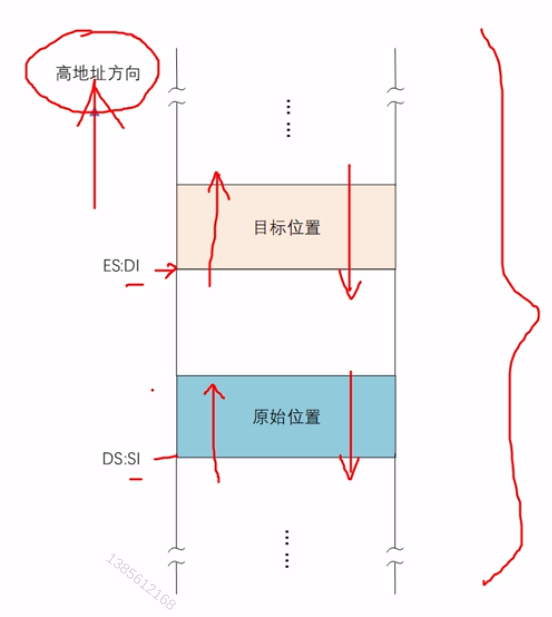
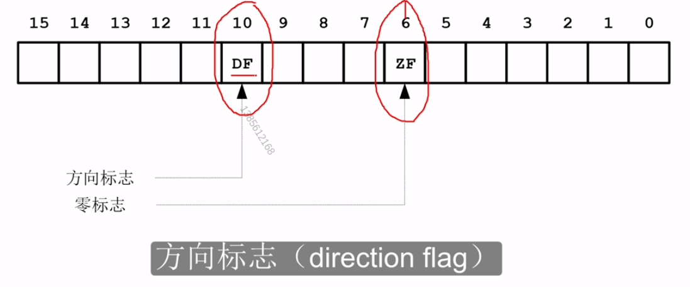
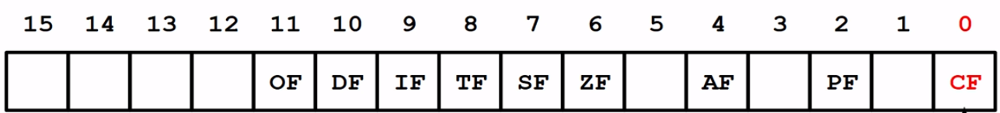

# 循环、批量传送和条件转移
上一节中我们在屏幕上显示了文本和数字，但是在编程的角度来说未免太过繁杂，这一节我们使用循环来实现相同的效果

## 逻辑段地址的重新设定

``` assembly
  mov ax, 0x7c0 ; 这样ds中保存了 0x07c0 -> 实际上就是保存了0x7c00
  mov ds, ax
```

## 传送指令与标志寄存器
`movsb` move string byte

`movsw` move string word

**这种指令只能执行一次**

### 传送前的准备工作

> 基地址与偏移

- DS:SI 原始数据串的段地址:偏移地址
- ES:DI 目标位置的段地址:偏移地址

``` assembly
  mov ax, 0x7c00
  mov ds, ax                    ;设置数据段基地址

  mov ax. 0xb800
  mov es, ax                    ;设置附加段基地址
  
  mov si, mytext                ;设置文本偏移
  mov di, 0                     ;设置显存偏移
```

> 设置传送方向




> 8086的标志寄存器FLAGS



``` assembly
cld ; 方向标志清零指令 指示传送方向为 从低到高
std ; 方向标志置1 指示传送方向为 从高到低
```

> 重复执行

`rep` repeat 重复执行后面的指令 重复的次数由`cx`中的内容决定 当`cx==0`结束重复

``` assembly
  mov cx, (start-mytext)/2
  rep movsw
```

##  NASM的$和$$记号
- `$` 当前行的汇编地址
- `$$` 当前段的汇编地址

``` assembly
jmp start

mytext :
  db 'L',0x07,'a',0x07,'b',0x07,'e',0x07,'l',0x07,' ',0x07,'o',0x07
  db 'f',0x07,'f',0x07,'s',0x07,'e',0x07,'t',0x07,':',0x07

start:
  mov ax, 0x07c0
  mov ds, ax                    ;设置数据段基地址

  mov ax, 0xb800
  mov es, ax                    ;设置附加段基地址

  cld                           ;方向标志清零指令 指示传送方向为 从低到高
  mov si, mytext                ;设置文本偏移
  mov di, 0                     ;设置显存偏移

  mov cx, (start-mytext)/2
  rep movsw

  jmp $

  times 510-($-$$) db 0
  db 0x55, 0xaa

```

## 使用循环指令和LOOP分解数位

**在8086上，LOOP指令的执行过程是**
- 将寄存器CX的内容减一
- 如果CX的内容不为0，转移到指定的位置处执行，否则顺序执行后面的指令

``` assembly
jmp start

mytext :
  db 'L',0x07,'a',0x07,'b',0x07,'e',0x07,'l',0x07,' ',0x07,'o',0x07
  db 'f',0x07,'f',0x07,'s',0x07,'e',0x07,'t',0x07,':',0x07

start:
  mov ax, 0x07c0
  mov ds, ax                    ;设置数据段基地址

  mov ax, 0xb800
  mov es, ax                    ;设置附加段基地址

  cld                           ;方向标志清零指令 指示传送方向为 从低到高
  mov si, mytext                ;设置文本偏移
  mov di, 0                     ;设置显存偏移

  mov cx, (start-mytext)/2
  rep movsw


  ; 得到标号所代表的汇编地址
  mov ax, number

  ;; 分解各个数位
  mov bx, ax
  mov cx, 5                     ;循环次数
  mov si, 10                    ;除数

digit:
  xor dx, dx
  div si
  mov [bx], dl                  ;保留数位
  inc bx
  loop digit

  jmp $

number times 5 db 0

  times 510-($-$$) db 0
  db 0x55, 0xaa

```

## 基址寻址和INC指令 

`mov [bx], dl` 其中`[bx]`代表着bx中保存着内存偏移地址:ds左移4位+偏移地址=物理地址

- 在8086处理器上，如果要用寄存器来提供偏移地址，只能使用BX/SI/DI/BP，不能使用其他寄存器

### 寄存器设计

- 寄存器BX在设计之处的作用之一就是用来提供数据访问的基地址，所以又叫**基址寄存器(Base Address Register)**
- 在设计8086处理器时。每个寄存器都有自己的特殊用途，不如AX是累加器(Accumulator),与之相关的指令还会做指令数据长度上的优化
- CX是计数器(Counter) 
- DX是数据(Data)寄存器，除了作为通用寄存器使用外，还专门用于和外设之间进行数据传送
- SI 是源索引寄存器
- DI 是目标索引寄存器

### INC递增

`inc r/m`
- inc al
- inc di
- inc byte [0x2002]

## 数字的显示和DEC指令
### DEC递减
- `dec r/m`
- dec al
- dec di
- dec byte [0x2002]
### 显示数字

``` assembly
jmp start

mytext :
  db 'L',0x07,'a',0x07,'b',0x07,'e',0x07,'l',0x07,' ',0x07,'o',0x07
  db 'f',0x07,'f',0x07,'s',0x07,'e',0x07,'t',0x07,':',0x07

start:
  mov ax, 0x07c0
  mov ds, ax                    ;设置数据段基地址

  mov ax, 0xb800
  mov es, ax                    ;设置附加段基地址

  cld                           ;方向标志清零指令 指示传送方向为 从低到高
  mov si, mytext                ;设置文本偏移
  mov di, 0                     ;设置显存偏移

  mov cx, (start-mytext)/2
  rep movsw


  ; 得到标号所代表的汇编地址
  mov ax, number

  ; 分解各个数位
  mov bx, ax
  mov cx, 5                     ;循环次数
  mov si, 10                    ;除数

digit:
  xor dx, dx
  div si
  mov [bx], dl                  ;保留数位
  inc bx                        ;相当于(*bx)++
  loop digit                    ;当cx为0时 结束循环

  ;; 开始显示各个数位
  mov cx, 5
show:
  dec bx
  mov al, [bx]
  add al, 0x30
  mov ah, 0x04
  mov [es:di], ax
  add di, 2
  loop show

  jmp $

number times 5 db 0

  times 510-($-$$) db 0
  db 0x55, 0xaa

```

## 基址变址寻址和条件转移指令

- 在8086处理器上，只允许一下集中基址变址的组合
  - bx + si
  - bx + di
  - bp + si
  - bp + di

- 非法的例子
  - bx + ax
  - ax + cx

``` assembly
jmp start

mytext :
  db 'L',0x07,'a',0x07,'b',0x07,'e',0x07,'l',0x07,' ',0x07,'o',0x07
  db 'f',0x07,'f',0x07,'s',0x07,'e',0x07,'t',0x07,':',0x07

start:
  mov ax, 0x07c0
  mov ds, ax                    ;设置数据段基地址

  mov ax, 0xb800
  mov es, ax                    ;设置附加段基地址

  cld                           ;方向标志清零指令 指示传送方向为 从低到高
  mov si, mytext                ;设置文本偏移
  mov di, 0                     ;设置显存偏移

  mov cx, (start-mytext)/2
  rep movsw


  ; 得到标号所代表的汇编地址
  mov ax, number

  ; 分解各个数位
  mov bx, ax
  mov cx, 5                     ;循环次数
  mov si, 10                    ;除数

digit:
  xor dx, dx
  div si
  mov [bx], dl                  ;保留数位
  inc bx                        ;相当于(*bx)++
  loop digit                    ;当cx为0时 结束循环

  ;; 开始显示各个数位
  mov bx, number
  mov si, 4
show:
  mov al, [bx+si]               ;遍历number数组 => ds + bx + si 基址变址寻址
  add al, 0x30                  ;转换为字符
  mov ah, 0x04                  ;上色 [al|ah] 8086是低端字节序

  mov [es:di], ax               ;接着之前的文本继续写
  add di, 2

  dec si
  jns show                      ;SF==0 执行跳转 , SF==1 向下执行

  jmp $

number times 5 db 0

  times 510-($-$$) db 0
  db 0x55, 0xaa

```


## 8086的标志寄存器们


> CF Carry Flag 进位标志

当一个算术操作在结果的最高位产生进位或者借位时，此标志为1,否则为0

``` assembly
mov al, 0x80 ; 1000 0000
add al, al CF==1
```

> PF Parity Flag 奇偶标志

``` assembly

```

> AF

``` assembly

```

> ZF Zero Flag 

``` assembly

```

> SF Sign Flag

用运算结果的最高位来设置此标志(一般来说，这一位是有符号的符号位。0表示正数，1表述负数)

``` assembly
  mov si, 1
  dec si
  dec si
  SF == 1
```

> TF

``` assembly

```


> IF

``` assembly

```


> DF

``` assembly

```

> OF Overflow Flag 溢出标志

``` assembly
mov ah, 155
add ah, ah
OF == 1
```

## 条件转移指令和CMP指令


