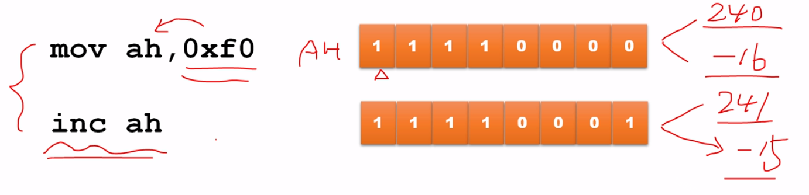

# 计算机中的负数

## 一个负数的表示

| 二进制              | 十进制                                    |
|:-------------------:|:-----------------------------------------:|
| 1111 1111 1111 1110 | -(1\*2^15)+1\*2^14 + 1\*2^13+...0\*2^0=-2 |
| 1111 1101           | -(1\*2^7)+1\*2^6 + 1\*2^5+...1\*2^0=-3    |

## 减法指令SUB和求补指令NEG

`mov di, -24`

> SUB

`sub r/m, r/m/imm` 结果保存在前面的寄存器/内存中
- sub al, 35
- sub dx, ax
- sub dx, [0x2002]
- sub byte [0x2002], 37
- sub byte [0x2002], al

> NEG 对值求补码

`neg r/m`
- neg al
- neg di
- neg byte [0x2002]

``` assembly
  jmp start
start:
  mov bx, 2
  neg bx

  jmp $

number times 5 db 0

  times 510-($-$$) db 0
  db 0x55, 0xaa

```

## 计算机如何区分对待有无符号数
**不区分，看程序员怎么定义**




## 有符号数除法指令 IDIV
`idev r/m`

- 如果在指令中指定的是8位寄存器或者8位操作数的内存地址，则意味着被除数在寄存器AX中
- 相除后，商在寄存器AL中，余数在寄存器AH中

- 如果在指令中指定的是16位寄存器或者16位操作数的内存地址，则意味着被除数是32位的，低16位在AX中，高16位在DX中
- 相除后，商在寄存器AX中，余数在寄存器DX中

- 如果在指令中指定的是32位寄存器或者32位操作数的内存地址，则意味着被除数是64位的，低32位在EAX中，高32位在EDX中
- 相除后，商在寄存器EAX中，余数在寄存器EDX中

- 如果在指令中指定的是64位寄存器或者64位操作数的内存地址，则意味着被除数是128位的，低64位在RAX中，高64位在RDX中
- 相除后，商在寄存器RAX中，余数在寄存器RDX中

## 有符号数的符号扩展指令


``` assembly
  jmp start
start:
  mov ax, -6002
  cwd
  mov bx, -10
  idiv bx

  jmp $

number times 5 db 0

  times 510-($-$$) db 0
  db 0x55, 0xaa

```

``` assembly
CPU0:
rax: 00000000_0000e88e
rbx: 00000000_00000000
rcx: 00000000_00090000
rdx: 00000000_0000ffff
rsp: 00000000_0000ffd6
rbp: 00000000_00000000
rsi: 00000000_000e0000
rdi: 00000000_0000ffac
r8 : 00000000_00000000
r9 : 00000000_00000000
r10: 00000000_00000000
r11: 00000000_00000000
r12: 00000000_00000000
r13: 00000000_00000000
r14: 00000000_00000000
r15: 00000000_00000000
rip: 00000000_00007c06
eflags 0x00000082: id vip vif ac vm rf nt IOPL=0 of df if tf SF zf af pf cf
```
