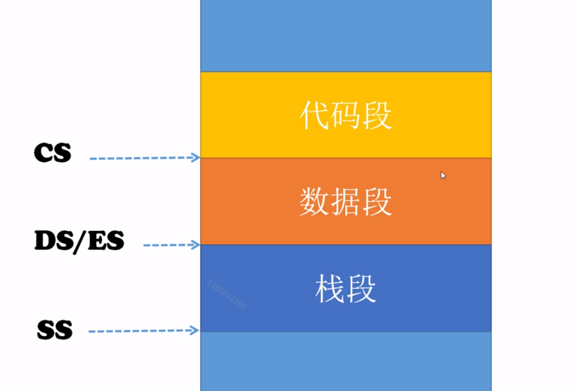
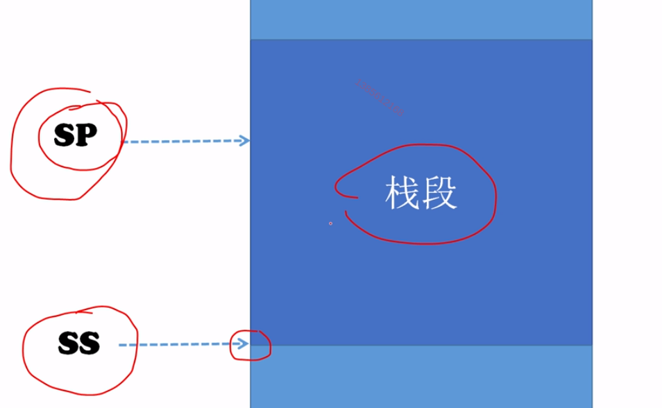
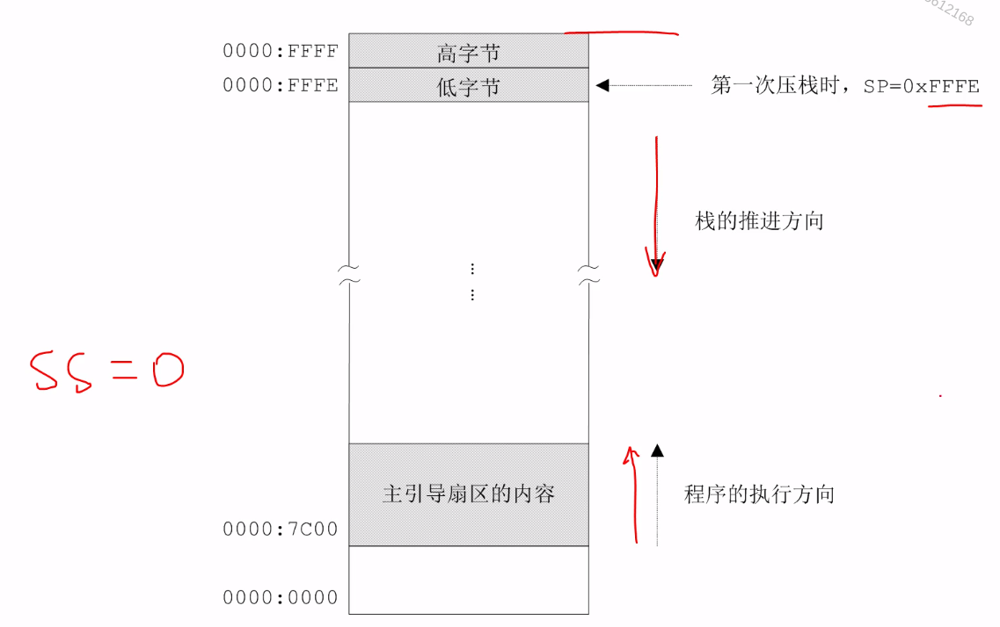

# 从1加到100并显示结果

我们先计算出这个结果

``` assembly
jmp start

message:
  db '1+2+3+...+100='

start:
  mov ax, 0x07c0
  mov ds, ax                    ;设置数据段基地址

  mov ax, 0xb800
  mov es, ax                    ;设置附加段基地址

  ;; 显示字符串
  mov si, message
  mov di, 0
  mov cx, start - message
showmsg:
  mov al, [si]
  mov [es:di], al
  inc di
  mov byte [es:di], 0x07
  inc di
  inc si
  loop showmsg

  ;; 以下计算1到100
  xor ax, ax                    ;ax存放累加结果
  mov cx, 1
summate:
  add ax, cx
  inc cx
  cmp cx, 100
  jle summate

  jmp $

number times 5 db 0

  times 510-($-$$) db 0
  db 0x55, 0xaa

```

## 栈的原理和使用




- **SS:SP 这个整体构成了栈顶指针**

- **栈的操作都是以字为单位的**

- **SS是栈段寄存器， 是Sp永远指向栈顶。 不存在栈底**

> push

`push r/m` 
- push dx
- push word [0x2002]


**push的执行过程**
1. SP -= 操作数的大小(bytes)
2. 段寄存器SS 左移4位，加上SP中的偏移地址，生成物理地址
3. 将操作数写入上述地址处

> pop

`pop r/m`
- pop ax
- pop word [0x08]


**pop的执行过程**
1. 段寄存器SS 左移4位，加上SP中的偏移地址，生成物理地址
2. 从上述地址处取得数据，存入由操作数提供的目标位置处
3. SP += 2

## 栈在数位分解与显示中的应用

``` assembly
mov ss, 0
mov sp, 0

ss:sp => 栈顶
sp -= 2
ss:sp == 0000:FFFE
```



``` assembly
jmp start

message:
  db '1+2+3+...+100='

start:
  mov ax, 0x07c0
  mov ds, ax                    ;设置数据段基地址

  mov ax, 0xb800
  mov es, ax                    ;设置附加段基地址

  ;; 显示字符串
  mov si, message
  mov di, 0
  mov cx, start - message
showmsg:
  mov al, [si]
  mov [es:di], al
  inc di
  mov byte [es:di], 0x07
  inc di
  inc si
  loop showmsg

  ;; 以下计算1到100
  xor ax, ax                    ;ax存放累加结果
  mov cx, 1
summate:
  add ax, cx
  inc cx
  cmp cx, 100
  jle summate

  ;; 以下分解累加和的各个数位
  xor cx, cx                    ;设置SS
  mov ss, cx
  mov sp, cx

  mov bx, 10
  xor cx, cx
decompo:
  inc cx
  xor dx, dx
  div bx                        ;商在ax 余数在dx
  add dl, 0x30
  push dx

  cmp ax, 0                     ;如果商为0,就结束循环
  jne decompo

shownum:
  pop dx
  mov [es:di], dl
  inc di
  mov byte [es:di], 0x07
  inc di
  loop shownum

  jmp $

number times 5 db 0

  times 510-($-$$) db 0
  db 0x55, 0xaa

```

**push在执行后不影响任何标志位**

## 进一步认识栈和栈操作
> 相同的效果

``` assembly
push cs
pop ds

mov ax, cs
mov ds, ax
```

``` assembly
push ax

sub sp, 2
mov bx, sp
mov [ss:bx], ax   ; 只能使用 bx bp si di
```

``` assembly
pop ax

mov bx, sp
mov ax. [ss:bx]   ; 只能使用 bx bp si di
add sp, 2
```

**必须保证栈平衡**

## 逻辑或指令OR和逻辑与指令AND
