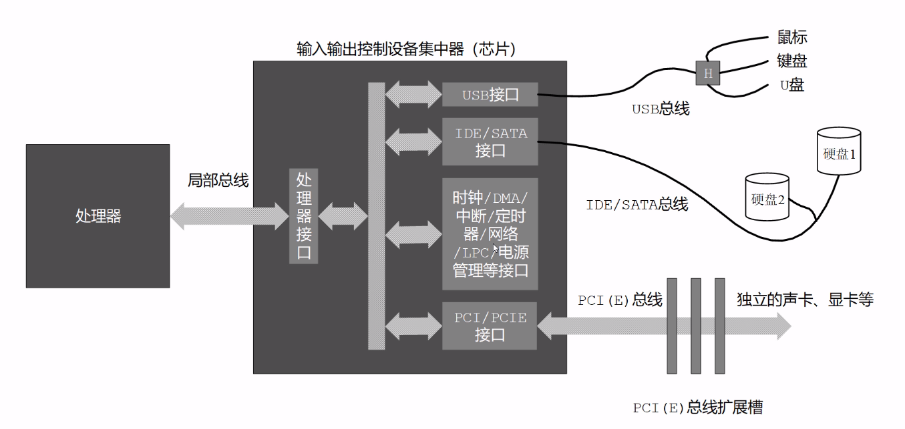

# 硬盘和显卡的访问与控制

## 给汇编语言程序分段
因为一个段的大小有上限，想要在一个段内放很多数据是不行的，所以我们可以分开放

使用`SECTION/SEGMENT`开始 默认4byte对齐

``` assembly
section data1 ALIGN=16          ;16字节对齐
  mydata dw 0xABCD

section data2 ALIGN=16          ;16字节对齐
  string db 'hello'

segment code ALIGN=16
  mov bx, mydata
  mov si, string

```


## 控制段内元素的汇编地址

``` assembly
0000000 abcd 0000 0000 0000 0000 0000 0000 0000
0000010 6568 6c6c 006f 0000 0000 0000 0000 0000
0000020 00bb be00 0010
0000026
```

``` assembly
section data1 ALIGN=16          ;16字节对齐
  mydata dw 0xABCD

section data2 ALIGN=16 VSTART=0 ;虚拟汇编地址
  string db 'hello'

segment code ALIGN=16
  mov bx, mydata
  mov si, string

```

``` assembly
section s1
  offset dw str1, str2, num

section s2 ALIGN=16 VSTART=0x100
  str1 db 'hello'
  str2 db 'world'

section s3 ALIGN=16
  num dw 0xbad

```


``` assembly
0000000 0100 0105 0020 0000 0000 0000 0000 0000
0000010 6568 6c6c 776f 726f 646c 0000 0000 0000
0000020 0bad
0000022
```

## 加载器和用户程序头部段
**主引导扇区程序的任务应该是一个用户程序加载器 loader**


> 用户程序头部

- 程序的总长度
- 入口点(段地址:偏移地址)
- 段重定位表项数
- 段重定位表


计算一个段相对于程序开头的汇编地址

``` assembly
section.段名字.start
```

``` assembly
SECTION header VSTART=0         ;程序的头部
progran_length:
  dd program_end ;程序的总长度

  ;; 用户程序入口点
code_entry:
  dw start              ;偏移地址
  dd section.code.start ;段地址

  ;; 段重定位表项个数
  realloc_tbl_len dw (segtbl_end-segtbl_begin)/4

  ;; 段重定位表
segtbl_begin:
  code_segment dd section.code.start ;[0x0C]
  data_segment dd section.data.start ;[0x10]
  stack_segment dd  section.stack.start ;[0x14]
segtbl_end:

;; =================================================================
SECTION code ALIGN=16 VSTART=0
start:
  ;; 初识执行时 DS 和 ES 指向用户程序头部段
  mov ax, [stack_segment]
  mov ss, ax
  mov sp, stack_pointer         ;设置初识的栈顶指针

  mov ax, [data_segment]        ;设置用户程序自己的数据段
  mov ds, ax

  mov ax, 0xb800
  mov es, ax

  mov si, message
  mov di, 0

next:
  mov al, [si]
  cmp al, 0
  je exit
  mov byte [es:di], al
  mov byte [es:di], 0x07
  inc si
  add di, 2
  jmp next

exit:
  jmp $

;; =================================================================
SECTION data ALIGN=16 VSTART=0
message:
  db 'hello world.', 0

;; =================================================================
SECTION stack ALIGN=16 VSTART=0
  resb 256
stack_pointer:

;; =================================================================
SECTION trail ALIGN=16
program_end:

```

## 加载器的工作流程和常数声明

1. 读取用户程序的其实扇区
2. 把整个用户程序都读到内存
3. 计算段的物理地址和逻辑段地址(段的重定位)
4. 转移到用户程序执行(将处理器的控制权交给用户程序)

``` assembly

  ;; 声明常数(用户程序起始逻辑扇区号)
  ;; 常数的声明不会占用汇编地址
  app_lba_start equ 100
```

## 确定用户程序的加载位置


``` assembly
  ;; 声明常数(用户程序起始逻辑扇区号)
  ;; 常数的声明不会占用汇编地址
  app_lba_start equ 100

SECTION mbr align=16 vstart=0x7c00
  ;;设置堆栈段和栈指针
  mov ax, 0
  mov ss, ax
  mov sp, ax

  ;; 将phy_base这个用户起始段地址算出来
  mov ax, [cs:phy_base]         ;计算用于加载用户程序的逻辑段地址 0x0000:0x7c00+phy_base
  mov dx, [cs:phy_base+0x02]
  mov bx, 0x10
  div bx
  mov ds, ax                    ;令DS和ES指向该段以进行操作
  mov es, ax

  ;;  以下读取程序的起始部分
  ...
  
phy_base:                       ;用户程序被加载的物理起始地址 注意是32位的 H=>DX L=>AX
  dd 0x10000

  times 510-($-$$) db 0
  db 0x55aa

```


## 外围设备及其接口




## 输入输出端口的访问

端口号范围:`0~65535`

一般用`DX`存放端口号

> IN指令 从端口读数据到处理器

- in al/ax, dx/imm8

``` assembly
;; 如果端口小于256(0x100)
in al, 0x60
in ax, 0xa7

mov dx, 0x30
in ax, dx

```

> OUT指令 从处理器取数据到端口

- out dx/imm8, al/ax

``` assembly
;; 如果端口小于256
out 0x60, al
out 0xa7, ax

mov dx, 0x3c0
out dx, ax
```

## 通过硬盘控制器端口读扇区数据

磁盘是块设备(Block)

- CHS(Cylinder.Header.Sector) 向硬盘控制器发送柱面号、磁头号和扇区在柱面上的编号
- LBA(Logical Block Addressing) 将所有可用扇区都统一编号

**这一章我们使用LBA28**

**在PC上，主硬盘控制器被分配了8个端口(0x1f0 ~ 0x1f7)**

1. 设置要读取的扇区数量(0x1f2)

``` assembly
mov dx, 0x1f2
mov al, 0x01   ; 一个扇区
out dx, al     ; 1~255 表示读取1~255个扇区 0表示读取256个扇区
```

2. 设置起始的LBA扇区号(0x1f3、0x1f4、0x1f5、0x1f6)


``` assembly
  ;; 扇区号=0000 00000000 00000000 00000010
  mov dx, 0x1f3
  mov al, 0x02
  out dx, al                    ;00000010

  inc dx                        ;0x1f4
  mov al, 0x00
  out dx, al                    ;00000000

  inc dx                        ;0x1f5
  out dx, al                    ;00000000

  inc dx                        ;0x1f6
  mov al, 0xe0                  ;11(0/1 CHS/LBA)10(0/1 主/从) 0000
  out dx, al                    ;1110 0000(28位的前4位)


```

3. 向端口 0x1f7 写入 0x20 请求硬盘读

``` assembly
  mov dx, 0x1f7
  mov al, 0x20                  ;读命令
  out dx, al
```

4. 等待读写操作完成 (0x1f7)


``` assembly
  mov dx, 0x1f7                 ;0x1f7 既是状态端口又是命令端口
  .waits:
  in al, dx
  and al, 0x88                  ;0x88 1000 1000 表示不忙，且硬盘已经准备好数据了
  cmp al, 0x08
  jnz .waits

```

5. 连续地取出数据 (0x1f0)

``` assembly
  ;; 假定DS已经指向存放扇区数据的段 BX里是段内偏移地址
  mov cx, 256                   ;总共要读取的字数
  mov dx, 0x1f0
.readw:
  in ax, dx
  mov [bx], ax
  add bx, 2
  loop .readw
```

## 过程和过程调用


``` assembly
;; ---------------------------read_hard_disk_0-------------------------------------
read_hard_disk_0:               ;从硬盘读取一个逻辑扇区
                                ;输入 DI:SI 起始逻辑扇区号
                                ;DS:BX = 目标缓冲区地址
  ;; 保存原有数据
  push ax
  push bx
  push cx
  push dx

  mov dx, 0x1f2
  mov al, 0x01   ; 一个扇区
  out dx, al     ; 1~255 表示读取1~255个扇区 0表示读取256个扇区

  ;; 扇区号 = DS : SI xxxxabcd xxxxxxxx : xxxxxxxx xxxxxxxx
  inc dx                        ;0x1f3
  mov ax, si
  out dx, al                    ; 7~0

  inc dx                        ;0x1f4
  mov al, ah
  out dx, al                    ; 15~8

  inc dx                        ;0x1f5
  mov ax, di
  out dx, al                    ; 23~16

  inc dx                        ;0x1f6
  mov al, 0xe0                  ;11(CHS/LBA)10(主/从) 0000
  or al, ah                     ; 27~24 11100000 | xxxxabcd == 1110abcd
  out dx, al                    ;1110 abcd(28位的前4位)


  mov dx, 0x1f7
  mov al, 0x20                  ;读命令
  out dx, al

  mov dx, 0x1f7                 ;0x1f7 既是状态端口又是命令端口
.waits:
  in al, dx
  and al, 0x88                  ;0x88 1000 1000 表示不忙，且硬盘已经准备好数据了
  cmp al, 0x08
  jnz .waits

  ;; 假定DS已经指向存放扇区数据的段 BX里是段内偏移地址
  mov cx, 256                   ;总共要读取的字数
  mov dx, 0x1f0
.readw:
  in ax, dx
  mov [bx], ax
  add bx, 2
  loop .readw

  ;; 恢复原有数据
  pop ax
  pop bx
  pop cx
  pop dx

  ret

```

## 过程调用和返回的原理


> 16位相对近调用

`call 标号` 机器码 0xE8 相对偏移量 **会将IP压栈**

> RET 将IP弹栈 从而恢复了原来执行的地方

## 加载整个用户程序

a

## 用户程序的重定位

## 比特位的移动指令

## 转到用户程序内部执行

## 8086的无条件转移指令

## 用户程序的执行过程

## 验证加载器加载和执行用户程序的过程

## 书中第八章用户程序概述

## 与文本显示有关的回车、换行与光标控制

## 回车的光标处理和乘法指令MUL

## 换行和普通字符的处理过程与滚屏操作

## 8086的过程调用方式

## 通过RETF指令转到另一个代码段内执行

## 在程序中访问不同的数据段

## 使用新版FixVhdWr写虚拟硬盘并运行程序
